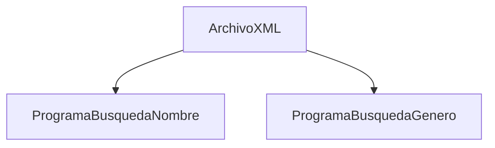

# Anime
>[!IMPORTANT]
> Empece a hacer el programa con otra cuenta de correo configurada en git y como lo tengo como una cuenta de Github pues bueno

Este programa sirve para mostrar los animes almacenados en un XML, permitiendo buscar un anime especifico por nombre.

Tambien permite buscar por generos todos los anime de ese genero

